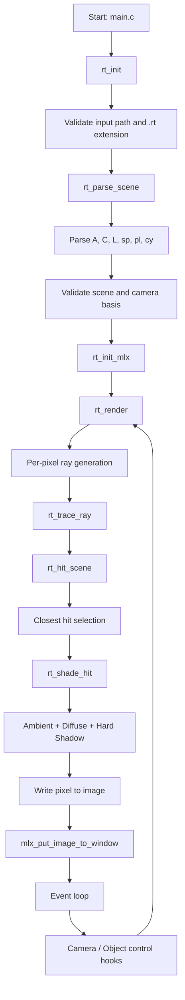
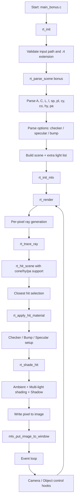

*This project has been created as part of the 42 curriculum by hyeonwki, kyu-choi.*

## Common

### Description

`miniRT` is a small C ray tracer built with MiniLibX.
It parses `.rt` scene files and renders computer-generated images
using the Raytracing protocol: geometric objects, a camera, and a
lighting system.

This repository provides two isolated binaries:

| Binary | Build command | Description |
| --- | --- | --- |
| `miniRT` | `make` | Mandatory – baseline ray tracer |
| `miniRT_bonus` | `make bonus` | Bonus – extended visual effects |

Mandatory and bonus are separated by headers, sources, objects, and
entry points.

### Instructions

#### Build

```bash
make          # mandatory binary
make bonus    # bonus binary
```

#### Run

```bash
./miniRT scenes/04_minimal.rt
./miniRT_bonus scenes/22_bonus_multi_light.rt
./miniRT_bonus scenes/27_bonus_cone_bump_mix.rt
./miniRT_bonus scenes/24_bonus_hyperboloid.rt
./miniRT_bonus scenes/25_bonus_paraboloid.rt
./miniRT_bonus scenes/28_bonus_all_shapes.rt
```

#### Clean / Rebuild

```bash
make clean    # remove object files
make fclean   # remove all generated files
make re       # full rebuild
```

#### Validation

```bash
norminette includes src
```

Memory leak check (platform-specific):

```bash
# macOS
leaks --atExit -- ./miniRT scenes/01_invalid.rt

# Linux
valgrind --leak-check=full ./miniRT scenes/01_invalid.rt
```

#### Runtime Controls

All controls are displayed in an on-screen overlay (toggle with `H`).

##### Camera

| Key | Action | Detail |
| --- | --- | --- |
| `W` / `S` | Move forward / backward | Along camera direction |
| `A` / `D` | Move left / right | Along camera right axis |
| `Q` / `E` | Move up / down | Along camera up axis |
| `←` / `→` | Rotate yaw left / right | Around world Y axis |
| `↑` / `↓` | Rotate pitch up / down | Around camera right axis |

##### Light

| Key | Action | Axis |
| --- | --- | --- |
| `J` / `L` | Move active light left / right | X |
| `U` / `O` | Move active light up / down | Y |
| `I` / `K` | Move active light forward / backward | Z |
| `P` | Cycle active light (bonus) | Multi-light scenes |

##### Object

| Key | Action | Note |
| --- | --- | --- |
| `TAB` | Cycle through objects | Selects next object in scene |
| `F` / `B` | Move selected object | X axis |
| `R` / `Y` | Move selected object | Y axis |
| `T` / `G` | Move selected object | Z axis |
| `Z` / `X` | Rotate object axis (yaw) | Around world Y; not sphere |
| `C` / `V` | Rotate object axis (pitch) | Around world X; not sphere |
| `+` / `-` | Change radius | Sphere, cylinder, cone, hyperboloid, paraboloid |
| `N` / `M` | Change height | Cylinder / cone / hyperboloid / paraboloid |

##### General

| Key | Action |
| --- | --- |
| `1` | Toggle debug axes (X=red, Y=green, Z=blue from origin) |
| `H` | Toggle on-screen control guide |
| `ESC` | Close window and exit cleanly |
| Window close button | Close window and exit cleanly |

#### MiniLibX Resolution Order

- **Darwin (macOS)**
  1. `minilibx_opengl_20191021`
  2. `minilibx_macos`
  3. `minilibx`
  4. `minilibx_mms_20200219`
- **Linux**
  1. `minilibx-linux`
  2. `minilibx`

If `MLX_DIR` is set explicitly, the same Makefile is used.
On current Swift toolchains, `minilibx_mms_20200219` may fail.
When `minilibx_opengl_20191021` exists, Makefile falls back to it
automatically.

### Mandatory vs Bonus at a Glance

| Part | Core goal | Typical result |
| --- | --- | --- |
| Mandatory | Build a stable base ray tracer | Correct objects, camera, light, shadows |
| Bonus | Add richer visual effects | Better realism and richer scene features |

### Math Basics (Explained Very Simply)

#### 1) Vector = an arrow

A vector is like an arrow with direction and size.
We use vectors for camera direction, light direction, and surface
normals.

#### 2) Add / Subtract vectors = move arrows

- Add vectors: combine movements.
- Subtract vectors: get direction from one point to another.

#### 3) Dot product = "how much same direction"

- Big positive → same direction.
- Near zero → perpendicular.
- Negative → opposite direction.

Diffuse lighting uses this idea:
`max(0, dot(normal, light_dir))`.

#### 4) Normalize = keep direction, make size 1

Normalization keeps the direction but fixes the vector length to 1.
This makes lighting and intersection math stable and predictable.

#### 5) Ray equation = laser path

A ray is:

- origin `O`
- direction `D`

Every point on the ray is `P(t) = O + t * D`.
`t` means "how far from the start".

#### 6) Intersections = solve equations

- Sphere: quadratic equation.
- Plane: linear equation with dot product.
- Cylinder / Cone: quadratic + shape range checks.
- Hyperboloid: quadratic with `perp² - m·axial² = r²`.
- Paraboloid: quadratic with `perp² = k·axial`.

#### 7) Shadow ray = blocker check

From the hit point, shoot a ray to the light.
If something is in between, the point is in shadow.

#### 8) Lighting layers

- Ambient: minimum base light.
- Diffuse: based on surface–light angle.
- Specular (bonus): shiny highlight effect.

#### 9) Camera and FOV

- Camera position: where you look from.
- Camera direction: where you look toward.
- FOV: how wide the view is.

Small FOV feels zoomed in; large FOV feels wide-angle.

### Resources

- Subject PDF (official):
  https://cdn.intra.42.fr/pdf/pdf/195507/en.subject.pdf
- GitHub references (Norminette, MiniLibX source):
  https://github.com
- 42 Docs (MiniLibX guides):
  https://harm-smits.github.io/42docs
- MiniLibX man-style references:
  https://qst0.github.io
- Graphics theory references (Lambert, Phong, bump mapping):
  https://en.wikipedia.org
- Ray-tracing math tutorial references:
  https://www.scratchapixel.com

#### AI Usage

AI assistance was used for repetitive support tasks:

- Requirement checklist drafting.
- Repetitive verification planning.
- No blind copy-paste; outputs were reviewed, adapted, and tested.

---

## Mandatory

### Goal

Mandatory delivers a stable baseline ray tracer that satisfies the
core subject requirements without optional effects.

### Required Elements and Behavior

| Item | Requirement |
| --- | --- |
| Scene file | Parse valid `.rt` input and reject invalid configuration |
| Core identifiers | `A`, `C`, `L`, `sp`, `pl`, `cy` |
| Lighting | Ambient + diffuse lighting with hard shadows |
| Geometry | Correct intersections, including inside / overlap cases |
| Runtime behavior | Clean exit on `ESC` and window close, stable event loop |

### Flowchart (Mandatory)



### Implementation Overview (Mandatory)

| Topic | Current implementation |
| --- | --- |
| Parsing and validation | `src/mandatory/parse/*`, `src/mandatory/init/init.c` |
| Camera and ray generation | `src/mandatory/math/camera.c`, `src/mandatory/ray/trace.c` |
| Object intersections | `src/mandatory/ray/intersect_*.c` |
| Lighting and shadows | `src/mandatory/ray/shade.c`, `src/mandatory/ray/shadow.c` |
| Runtime controls and cleanup | `src/mandatory/init/*`, `src/mandatory/main.c` |

### Scene Set (Mandatory)

| # | Category | Scene file |
| --- | --- | --- |
| 1 | Error handling (invalid identifier) | `01_invalid.rt` |
| 2 | Error handling (duplicate camera) | `02_duplicate_camera.rt` |
| 3 | Error handling (invalid normal) | `03_invalid_normal.rt` |
| 4 | Display baseline | `04_minimal.rt` |
| 5 | Basic shape (sphere) | `05_basic_sphere.rt` |
| 6 | Basic shape (plane) | `06_basic_plane.rt` |
| 7 | Basic shape (cylinder) | `07_basic_cylinder.rt` |
| 8 | Translation (two spheres) | `08_translate_two_spheres.rt` |
| 9 | Rotation (cylinder Z 90°) | `09_rotate_cylinder_z90.rt` |
| 10 | Multiple objects (intersecting) | `10_multi_intersect.rt` |
| 11 | Multiple objects (duplicates) | `11_multi_duplicates.rt` |
| 12 | Camera on X axis | `12_camera_x.rt` |
| 13 | Camera on Y axis | `13_camera_y.rt` |
| 14 | Camera on Z axis | `14_camera_z.rt` |
| 15 | Camera random position | `15_camera_random.rt` |
| 16 | Brightness (side light) | `16_brightness_side.rt` |
| 17 | Brightness (translated object) | `17_brightness_translated.rt` |
| 18 | Shadow (simple) | `18_shadow_simple.rt` |
| 19 | Shadow (complex) | `19_shadow_complex.rt` |

---

## Bonus

### Goal

Bonus extends the baseline renderer with optional effects while
keeping mandatory and bonus code paths isolated.

### Added Features

| # | Subject bonus item | Connected implementation |
| --- | --- | --- |
| 1 | Specular reflection | Material params parsed in `parse_obj_opts_bonus.c` (`sp` option), applied in `shade_bonus.c` via `t_hit.specular` / `t_hit.shininess`. |
| 2 | Color disruption: checkerboard | Checker option parsed (`ck`), color computed in `pattern_bonus.c`, applied during material stage. |
| 3 | Colored and multi-spot lights | Extra lights parsed in `parse_env_bonus.c` (`l`), stored in `light_list_bonus.c`, iterated in `shade_bonus.c`. Per-light cycling with `P` key in `control_scene_bonus.c`. |
| 4 | Second-degree object: Cone | Parsed in `parse_cone_bonus.c`, intersected in `intersect_cone_bonus.c`, dispatched by scene pipeline. |
| 5 | Bump map textures | Bump params parsed (`bm`), normal perturbation in `material_bonus.c` before shading. |
| 6 | Hyperboloid (one-sheet) | Parsed via `hy` in `parse_hyperboloid_bonus.c`, intersected in `intersect_hyperboloid_bonus.c`. |
| 7 | Paraboloid (circular) | Parsed via `pa` in `parse_paraboloid_bonus.c`, intersected in `intersect_paraboloid_bonus.c`. |

### Scene File Format (Bonus)

A `.rt` scene file is a plain-text file where each non-empty line
describes one element.  Lines are parsed top-to-bottom; whitespace
separates fields.

---

#### Environment Elements

> Environment elements set up the basic rendering context.
> `A` and `C` must appear **exactly once**; `L` must appear
> **exactly once**; `l` may appear **zero or more** times.

##### ◦ Ambient lighting (`A`)

```text
A 0.2 255,255,255
```

| Field | Description | Constraint |
| --- | --- | --- |
| `A` | Identifier | Fixed literal |
| `0.2` | Ambient lighting ratio | `[0.0, 1.0]` |
| `255,255,255` | R,G,B color of ambient light | Each `[0, 255]`, comma-separated, no spaces |

- The ambient ratio controls the minimum light every surface receives,
  even when no direct light hits it.
- Setting `0.0` makes unlit areas completely black; `1.0` floods
  everything with flat ambient color.

##### ◦ Camera (`C`)

```text
C -50.0,0,20 0,0,1 70
```

| Field | Description | Constraint |
| --- | --- | --- |
| `C` | Identifier | Fixed literal |
| `-50.0,0,20` | x,y,z coordinates of the camera position (viewpoint) | Comma-separated doubles, no spaces |
| `0,0,1` | 3D normalized orientation vector (where the camera looks) | Each component `[-1, 1]`; the vector must have length ≈ 1 |
| `70` | Horizontal field of view in degrees (FOV) | `(0, 180)` exclusive |

- The orientation vector decides "which way the camera faces".
  For example `0,0,1` points toward +Z.
- A small FOV (e.g. 30) gives a telephoto / zoom effect; a large FOV
  (e.g. 120) gives a wide-angle / fisheye feel.

##### ◦ Main Light (`L`)

```text
L -40.0,50.0,0.0 0.6 10,0,255
```

| Field | Description | Constraint |
| --- | --- | --- |
| `L` | Identifier (main light, must appear once) | Fixed literal |
| `-40.0,50.0,0.0` | x,y,z coordinates of the light source | Comma-separated doubles |
| `0.6` | Light brightness ratio | `[0.0, 1.0]` |
| `10,0,255` | R,G,B color of the light | Each `[0, 255]` |

- In the mandatory part, the light color field is ignored (white
  light only).  In the bonus part, colored light is applied — the
  `R,G,B` values tint the light.
- The `L` light is also automatically added to the bonus multi-light
  list, so it participates in `P`-key cycling.

##### ◦ Extra Light (`l`) — bonus only

```text
l 8,10,-6 0.5 200,200,255
```

| Field | Description | Constraint |
| --- | --- | --- |
| `l` | Identifier (extra light, may appear multiple times) | Fixed literal, lowercase |
| `8,10,-6` | x,y,z coordinates of the light source | Comma-separated doubles |
| `0.5` | Light brightness ratio | `[0.0, 1.0]` |
| `200,200,255` | R,G,B color of the light | Each `[0, 255]` |

- Each `l` line adds another point light to the scene.
- All extra lights are stored in a linked list and iterated during
  shading to produce multi-light effects (colored shadows, tinted
  highlights).

---

#### Geometric Objects

> All objects share a common trailing section: `R,G,B [options]`.
> Options are **optional** and may appear in any combination after the
> color field.

##### ◦ Sphere (`sp`)

```text
sp 0.0,0.0,20.6 12.6 10,0,255
```

| Field | Description | Constraint |
| --- | --- | --- |
| `sp` | Identifier | Fixed literal |
| `0.0,0.0,20.6` | x,y,z coordinates of the sphere center | Comma-separated doubles |
| `12.6` | Sphere **diameter** (internally halved to radius) | `> 0` |
| `10,0,255` | R,G,B surface color | Each `[0, 255]` |

- The diameter is the full width; the parser stores `radius = diameter / 2`.
- Spheres have no axis or height — they are defined only by center
  and size.

##### ◦ Plane (`pl`)

```text
pl 0.0,-3.0,0.0 0.0,1.0,0.0 80,80,80
```

| Field | Description | Constraint |
| --- | --- | --- |
| `pl` | Identifier | Fixed literal |
| `0.0,-3.0,0.0` | x,y,z coordinates of a point on the plane | Comma-separated doubles |
| `0.0,1.0,0.0` | 3D normalized normal vector of the plane surface | Each component `[-1, 1]`; length ≈ 1 |
| `80,80,80` | R,G,B surface color | Each `[0, 255]` |

- The normal decides which direction the plane faces.
  `0,1,0` is a horizontal floor; `0,0,1` is a vertical wall facing +Z.
- A plane extends infinitely in all directions perpendicular to the
  normal.

##### ◦ Cylinder (`cy`)

```text
cy 0.0,0.0,14.0 0.0,1.0,0.0 6.0 8.0 60,180,200
```

| Field | Description | Constraint |
| --- | --- | --- |
| `cy` | Identifier | Fixed literal |
| `0.0,0.0,14.0` | x,y,z coordinates of the cylinder center | Comma-separated doubles |
| `0.0,1.0,0.0` | 3D normalized axis direction | Each component `[-1, 1]`; length ≈ 1 |
| `6.0` | Cylinder **diameter** (internally halved to radius) | `> 0` |
| `8.0` | Cylinder height | `> 0` |
| `60,180,200` | R,G,B surface color | Each `[0, 255]` |

- The center is the **midpoint** of the cylinder; it extends
  `height / 2` above and below along the axis.
- Both flat cap disks are rendered automatically.

##### ◦ Cone (`co`)

```text
co 0,1,20 0,1,0 4 6 220,200,60
```

| Field | Description | Constraint |
| --- | --- | --- |
| `co` | Identifier | Fixed literal |
| `0,1,20` | x,y,z coordinates of the cone center (apex midpoint) | Comma-separated doubles |
| `0,1,0` | 3D normalized axis direction | Each component `[-1, 1]`; length ≈ 1 |
| `4` | Cone base **diameter** (internally halved to radius) | `> 0` |
| `6` | Cone height | `> 0` |
| `220,200,60` | R,G,B surface color | Each `[0, 255]` |

- The center is the midpoint; the cone tapers from base radius to
  apex along the axis.
- A flat base cap is rendered at the wider end.

##### ◦ Hyperboloid (`hy`)

```text
hy -4,0,14 0,1,0 5 7 200,120,60
```

| Field | Description | Constraint |
| --- | --- | --- |
| `hy` | Identifier | Fixed literal |
| `-4,0,14` | x,y,z coordinates of the hyperboloid center (waist midpoint) | Comma-separated doubles |
| `0,1,0` | 3D normalized axis direction | Each component `[-1, 1]`; length ≈ 1 |
| `5` | Waist **diameter** (internally halved to radius) | `> 0` |
| `7` | Height of the hyperboloid | `> 0` |
| `200,120,60` | R,G,B surface color | Each `[0, 255]` |

- This is a **one-sheet hyperboloid**: the waist (thinnest part) sits
  at the center, and the shape flares outward toward both caps.
- Two flat cap disks close the top and bottom at `±height/2` from the
  center.

##### ◦ Paraboloid (`pa`)

```text
pa 4,-2,14 0,1,0 5 7 60,160,200
```

| Field | Description | Constraint |
| --- | --- | --- |
| `pa` | Identifier | Fixed literal |
| `4,-2,14` | x,y,z coordinates of the paraboloid vertex (bottom tip) | Comma-separated doubles |
| `0,1,0` | 3D normalized axis direction | Each component `[-1, 1]`; length ≈ 1 |
| `5` | Opening **diameter** at the top edge (internally halved to radius) | `> 0` |
| `7` | Height of the paraboloid | `> 0` |
| `60,160,200` | R,G,B surface color | Each `[0, 255]` |

- The vertex (pointy tip) sits at the center position; the shape
  opens upward along the axis for the specified height.
- A single flat cap disk closes the open top at `center + height * axis`.

---

#### Object Options (Bonus Suffixes)

> After the `R,G,B` color of any object, you may append **zero or
> more** of the following option tokens, separated by spaces.
> They can be combined freely (e.g. `ck 0.6 sp 0.4 48 bm 6.0 0.2`).

##### ◦ Checkerboard (`ck`)

```text
pl 0,-3,0 0,1,0 80,80,80 ck 0.6
```

| Token | Description | Constraint |
| --- | --- | --- |
| `ck` | Enable checkerboard pattern | Fixed literal |
| `0.6` | Pattern scale (optional; default `1.0`) | `> 0` |

- Alternates between the object's base color and black in a
  checkerboard grid.
- Smaller scale → finer (more frequent) pattern; larger scale →
  coarser pattern.

##### ◦ Specular (`sp`)

```text
sp 0,3,10 2 230,230,230 sp 0.5 64
```

| Token | Description | Constraint |
| --- | --- | --- |
| `sp` | Enable Phong specular reflection | Fixed literal (same letters as sphere `sp`, but appears **after** color) |
| `0.5` | Specular coefficient (how bright the highlight is) | `[0.0, 1.0]` |
| `64` | Shininess exponent (how tight / sharp the highlight is) | `≥ 1.0` |

- Higher specular coefficient → brighter white spot.
- Higher shininess → smaller, sharper highlight (metallic look);
  lower shininess → wider, softer highlight (matte look).

##### ◦ Bump mapping (`bm`)

```text
co 3,0,16 0,1,0 5.5 7.5 225,170,70 bm 6.2 0.2
```

| Token | Description | Constraint |
| --- | --- | --- |
| `bm` | Enable procedural bump mapping | Fixed literal |
| `6.2` | Bump pattern scale (optional; default `1.0`) | `> 0` |
| `0.2` | Bump strength (optional; default `0.15`) | `[0.0, 2.0]` |

- Perturbs the surface normal using a procedural noise function,
  creating the illusion of bumps and dents without changing geometry.
- Larger scale → coarser bumps; smaller scale → finer texture.
- Strength controls how far the normal is bent: `0.0` = no effect,
  `2.0` = extreme deformation.

---

#### Full Example

Below is a complete `.rt` scene file using all features:

```text
# Environment
A 0.10 255,255,255
C 0,4,-22 0,0,1 60
L -8,10,-6 0.5 255,200,200
l 8,10,-6 0.5 200,200,255
l 0,12,20 0.4 200,255,200

# Floor with checker pattern
pl 0,-3,0 0,1,0 80,80,80 ck 0.6

# Hyperboloid with specular
hy -4,0,14 0,1,0 5 7 200,120,60 sp 0.4 48

# Paraboloid with specular
pa 4,-2,14 0,1,0 5 7 60,160,200 sp 0.4 48

# Cone with specular
co 0,1,20 0,1,0 4 6 220,200,60 sp 0.3 36

# Shiny sphere
sp 0,3,10 2 230,230,230 sp 0.5 64
```

### Flowchart (Bonus)



### Implementation Overview (Bonus)

| Topic | Current implementation |
| --- | --- |
| Bonus parsing extensions | `src/bonus/parse/*` (`l`, `co`, `hy`, `pa`, object options) |
| Multi-light management | `src/bonus/scene/light_list_bonus.c`, per-light cycling in `control_scene_bonus.c` |
| Bonus intersections | `intersect_cone_bonus.c`, `intersect_hyperboloid_bonus.c`, `intersect_paraboloid_bonus.c` |
| Material extensions | `src/bonus/ray/material_bonus.c`, `pattern_bonus.c` |
| Bonus shading pipeline | `src/bonus/ray/shade_bonus.c`, `trace_bonus.c`, `shadow_bonus.c` |

### Identifier → Function Map (Bonus)

Below is a complete map: for each `.rt` identifier (or option suffix),
which functions handle **parsing**, **intersection / rendering**, and
**runtime control**.  Reading these functions is enough to understand
how that feature works end-to-end.

> **How to read this table:**
> 1. Pick an identifier (e.g. `hy`).
> 2. **Parse** column → the function that reads it from the `.rt` file.
> 3. **Intersection / Render** column → the function(s) that use it at
>    render time (hit test, shading, pattern, etc.).
> 4. **Runtime / Control** column → the function that handles live
>    keyboard interaction for that element.

#### Environment Identifiers

| ID | Parse function | File | Render function | File | Control |
| --- | --- | --- | --- | --- | --- |
| `A` | `rt_parse_ambient` | `parse_env_bonus.c` | `rt_ambient_term` (static) | `shade_bonus.c` | — |
| `C` | `rt_parse_camera` | `parse_env_bonus.c` | `rt_setup_camera`, `rt_ray_from_pixel` | `camera_bonus.c` | `rt_control_camera` → `control_camera_bonus.c` |
| `L` | `rt_parse_light` | `parse_env_bonus.c` | `rt_shade_hit` → iterates light list | `shade_bonus.c` | `rt_move_light` → `control_scene_bonus.c` |
| `l` | `rt_parse_light_extra` | `parse_env_bonus.c` | same as `L` (linked list) | `shade_bonus.c` | `rt_move_light` + `rt_cycle_light` (`P` key) → `control_scene_bonus.c` |

**Light pipeline in detail:**

```
rt_parse_light / rt_parse_light_extra
  └─ rt_parse_light_value  (parse_env_bonus.c)   — reads pos, ratio, color
  └─ rt_light_add          (light_list_bonus.c)   — appends t_light_node to list

rt_shade_hit               (shade_bonus.c)
  └─ iterates scene->lights linked list
     └─ rt_light_term      (shade_bonus.c)        — per-light contribution
        ├─ rt_in_shadow_light (shadow_bonus.c)     — shadow ray test
        ├─ rt_diffuse_term   (shade_bonus.c)       — Lambert diffuse
        └─ rt_specular_term  (shade_bonus.c)       — Phong specular
```

#### Object Identifiers

| ID | Parse function | Parse file | Intersection function | Intersection file |
| --- | --- | --- | --- | --- |
| `sp` | `rt_parse_sphere` | `parse_obj_bonus.c` | `rt_hit_sphere` | `intersect_sphere_bonus.c` |
| `pl` | `rt_parse_plane` | `parse_obj_bonus.c` | `rt_hit_plane` | `intersect_plane_bonus.c` |
| `cy` | `rt_parse_cylinder` | `parse_obj_bonus.c` | `rt_hit_cylinder` → `rt_hit_cylinder_side` + caps | `intersect_cylinder_bonus.c`, `intersect_cylinder_side_bonus.c` |
| `co` | `rt_parse_cone` | `parse_cone_bonus.c` | `rt_hit_cone` → lateral + `rt_hit_cone_base` | `intersect_cone_bonus.c` |
| `hy` | `rt_parse_hyperboloid` | `parse_hyperboloid_bonus.c` | `rt_hit_hyperboloid` → lateral + two caps | `intersect_hyperboloid_bonus.c` |
| `pa` | `rt_parse_paraboloid` | `parse_paraboloid_bonus.c` | `rt_hit_paraboloid` → lateral + one cap | `intersect_paraboloid_bonus.c` |

**Object pipeline in detail (every object follows this path):**

```
1. Parse:    rt_parse_line → rt_dispatch → rt_parse_<type>
                                                │
             File: parse_line_bonus.c           │  parse_obj_bonus.c
                                                │  parse_cone_bonus.c
                                                │  parse_hyperboloid_bonus.c
                                                │  parse_paraboloid_bonus.c
                                                ▼
2. Store:    rt_obj_new → rt_obj_add         (object_bonus.c)
                                                │
3. Hit test: rt_hit_scene → rt_hit_object    (intersect_scene_bonus.c)
                │                               │
                │  dispatches by obj->type:      ▼
                │  OBJ_SPHERE     → rt_hit_sphere      (intersect_sphere_bonus.c)
                │  OBJ_PLANE      → rt_hit_plane       (intersect_plane_bonus.c)
                │  OBJ_CYLINDER   → rt_hit_cylinder    (intersect_cylinder_bonus.c)
                │  OBJ_CONE       → rt_hit_cone        (intersect_cone_bonus.c)
                │  OBJ_HYPERBOLOID→ rt_hit_hyperboloid (intersect_hyperboloid_bonus.c)
                │  OBJ_PARABOLOID → rt_hit_paraboloid  (intersect_paraboloid_bonus.c)
                ▼
4. Material: rt_apply_hit_material           (material_bonus.c)
                ├─ rt_bump_normal               — bump mapping perturbation
                ├─ rt_get_object_color           — checker or base colour
                └─ copy specular / shininess
                                                │
5. Shade:    rt_shade_hit                    (shade_bonus.c)
                ├─ rt_ambient_term
                └─ for each light:
                   └─ rt_light_term
                      ├─ rt_in_shadow_light  (shadow_bonus.c)
                      ├─ rt_diffuse_term
                      └─ rt_specular_term
                                                │
6. Reflect:  rt_trace_depth (recursion ≤ 2)  (trace_bonus.c)
                                                │
7. Display:  rt_render → rt_render_row       (render_bonus.c)
```

**Runtime controls for objects (all in `control_scene_bonus.c`):**

| Action | Function | Keys |
| --- | --- | --- |
| Select next object | `rt_control_scene` (inline) | `TAB` |
| Move object position | `rt_move_object` | `F`/`B`, `R`/`Y`, `T`/`G` |
| Rotate object axis | `rt_rotate_object` | `Z`/`X`, `C`/`V` |
| Resize radius | `rt_resize_object` | `+`/`-` |
| Resize height (cy/co/hy/pa) | `rt_resize_object` | `N`/`M` |

#### Option Suffix Identifiers

| Option | Parse function | Parse file | Render function | Render file |
| --- | --- | --- | --- | --- |
| `ck` | `rt_parse_ck` (static) | `parse_obj_opts_bonus.c` | `rt_get_object_color` → `rt_checker_plane` / `rt_checker_volume` | `pattern_bonus.c` |
| `sp` | `rt_parse_sp` (static) | `parse_obj_opts_bonus.c` | `rt_specular_term` (static) | `shade_bonus.c` |
| `bm` | `rt_parse_bm` (static) | `parse_obj_opts_bonus.c` | `rt_bump_normal` (static) | `material_bonus.c` |

**Option dispatch:**

```
rt_parse_obj_options        (parse_obj_opts_bonus.c)
  └─ loop: rt_parse_one_opt
     ├─ "ck" → rt_parse_ck  — sets obj->checker, obj->checker_scale
     ├─ "sp" → rt_parse_sp  — sets obj->specular, obj->shininess
     └─ "bm" → rt_parse_bm  — sets obj->bump, obj->bump_scale, obj->bump_strength
```

### Scene File → Function Map (Bonus)

Each `.rt` scene file exercises a specific subset of features.
Below maps every bonus scene to the identifiers it contains, the
bonus features it tests, and the key functions that are exercised.

| Scene file | Identifiers used | Bonus features tested | Key functions exercised |
| --- | --- | --- | --- |
| `20_bonus_specular.rt` | `A` `C` `L` `sp` `pl` | Specular reflection (`sp` option) | `rt_parse_sp`, `rt_specular_term`, `rt_hit_sphere`, `rt_hit_plane` |
| `21_bonus_checker.rt` | `A` `C` `L` `sp` `pl` `cy` | Checkerboard (`ck`), specular | `rt_parse_ck`, `rt_checker_plane`, `rt_checker_volume`, `rt_hit_cylinder` |
| `22_bonus_multi_light.rt` | `A` `C` `L` `l` `sp` `pl` `cy` | Multi-light, colored lights, specular, checker | `rt_parse_light_extra`, `rt_light_add`, `rt_shade_hit` (multi-light loop), `rt_cycle_light` |
| `23_bonus_cone.rt` | `A` `C` `L` `sp` `pl` `co` | Cone object, specular, checker | `rt_parse_cone`, `rt_hit_cone`, `rt_hit_cone_base` |
| `26_bonus_bump_sphere.rt` | `A` `C` `L` `sp` `pl` `cy` | Bump mapping (`bm`), specular, checker | `rt_parse_bm`, `rt_bump_normal`, `rt_bump_gradient` |
| `27_bonus_cone_bump_mix.rt` | `A` `C` `L` `l` `sp` `pl` `co` | Cone + bump + multi-light + specular + checker | `rt_parse_cone`, `rt_hit_cone`, `rt_bump_normal`, `rt_shade_hit` (multi-light) |
| `24_bonus_hyperboloid.rt` | `A` `C` `L` `sp` `pl` `hy` | Hyperboloid object, specular, checker | `rt_parse_hyperboloid`, `rt_hit_hyperboloid`, `rt_hit_hyper_cap` |
| `25_bonus_paraboloid.rt` | `A` `C` `L` `sp` `pl` `pa` | Paraboloid object, specular, checker | `rt_parse_paraboloid`, `rt_hit_paraboloid`, `rt_hit_parab_cap` |
| `28_bonus_all_shapes.rt` | `A` `C` `L` `l` `sp` `pl` `co` `hy` `pa` | All shapes + multi-light + checker + specular | All intersection functions, `rt_shade_hit` (3 lights), `rt_cycle_light` |

**Common functions exercised by every scene:**

```
rt_parse_line → rt_dispatch          (parse_line_bonus.c)
rt_parse_ambient                     (parse_env_bonus.c)
rt_parse_camera                      (parse_env_bonus.c)
rt_parse_light                       (parse_env_bonus.c)
rt_setup_camera                      (camera_bonus.c)
rt_render → rt_render_row            (render_bonus.c)
rt_trace_ray → rt_trace_depth        (trace_bonus.c)
rt_hit_scene → rt_hit_object         (intersect_scene_bonus.c)
rt_apply_hit_material                (material_bonus.c)
rt_shade_hit                         (shade_bonus.c)
rt_in_shadow_light                   (shadow_bonus.c)
```

### Scene Set (Bonus)

| # | Bonus feature | Scene file |
| --- | --- | --- |
| 1 | Specular reflection | `20_bonus_specular.rt` |
| 2 | Checkerboard color disruption | `21_bonus_checker.rt` |
| 3 | Colored and multi-spot lights | `22_bonus_multi_light.rt` |
| 4 | Second-degree object (cone) | `23_bonus_cone.rt` |
| 5 | Bump map textures | `26_bonus_bump_sphere.rt`, `27_bonus_cone_bump_mix.rt` |
| 6 | Hyperboloid (one-sheet) | `24_bonus_hyperboloid.rt` |
| 7 | Paraboloid (circular) | `25_bonus_paraboloid.rt` |
| 8 | All shapes + multi-light | `28_bonus_all_shapes.rt` |
