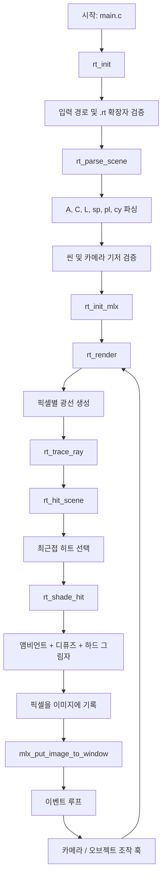

*이 프로젝트는 42 교육과정의 일환으로 hyeonwki, kyu-choi에 의해 제작되었습니다.*

## 공통

### 설명

`miniRT`는 MiniLibX로 제작된 소규모 C 레이 트레이서입니다.
`.rt` 씬 파일을 파싱하여 레이트레이싱 프로토콜(기하학적 오브젝트, 카메라, 조명
시스템)을 사용한 컴퓨터 생성 이미지를 렌더링합니다.

이 저장소는 두 개의 독립된 바이너리를 제공합니다:

| 바이너리 | 빌드 명령어 | 설명 |
| --- | --- | --- |
| `miniRT` | `make` | 필수(Mandatory) – 기본 레이 트레이서 |
| `miniRT_bonus` | `make bonus` | 보너스(Bonus) – 확장 시각 효과 |

필수 파트와 보너스 파트는 헤더, 소스, 오브젝트, 진입점이 완전히 분리되어
있습니다.

### 사용 방법

#### 빌드

```bash
make          # 필수 바이너리
make bonus    # 보너스 바이너리
```

#### 실행

```bash
./miniRT scenes/04_minimal.rt
./miniRT_bonus scenes/22_bonus_multi_light.rt
./miniRT_bonus scenes/27_bonus_cone_bump_mix.rt
./miniRT_bonus scenes/24_bonus_hyperboloid.rt
./miniRT_bonus scenes/25_bonus_paraboloid.rt
./miniRT_bonus scenes/28_bonus_all_shapes.rt
```

#### 정리 / 재빌드

```bash
make clean    # 오브젝트 파일 삭제
make fclean   # 모든 생성 파일 삭제
make re       # 전체 재빌드
```

#### 검증

```bash
norminette includes src
```

메모리 누수 검사 (플랫폼별):

```bash
# macOS
leaks --atExit -- ./miniRT scenes/01_invalid.rt

# Linux
valgrind --leak-check=full ./miniRT scenes/01_invalid.rt
```

#### 런타임 조작법

모든 조작법은 화면 오버레이에 표시됩니다 (`H`로 토글).

##### 카메라

| 키 | 동작 | 상세 |
| --- | --- | --- |
| `W` / `S` | 앞으로 / 뒤로 이동 | 카메라 방향 기준 |
| `A` / `D` | 왼쪽 / 오른쪽 이동 | 카메라 오른쪽 축 기준 |
| `Q` / `E` | 위 / 아래 이동 | 카메라 위쪽 축 기준 |
| `←` / `→` | 좌우 회전 (요) | 월드 Y축 기준 |
| `↑` / `↓` | 상하 회전 (피치) | 카메라 오른쪽 축 기준 |

##### 조명

| 키 | 동작 | 축 |
| --- | --- | --- |
| `J` / `L` | 현재 조명 좌/우 이동 | X |
| `U` / `O` | 현재 조명 위/아래 이동 | Y |
| `I` / `K` | 현재 조명 앞/뒤 이동 | Z |
| `P` | 활성 조명 순환 (보너스) | 다중 조명 씬 |

##### 오브젝트

| 키 | 동작 | 비고 |
| --- | --- | --- |
| `TAB` | 오브젝트 순환 선택 | 씬의 다음 오브젝트 선택 |
| `F` / `B` | 선택 오브젝트 이동 | X축 |
| `R` / `Y` | 선택 오브젝트 이동 | Y축 |
| `T` / `G` | 선택 오브젝트 이동 | Z축 |
| `Z` / `X` | 오브젝트 축 회전 (요) | 월드 Y축 기준; 구체 제외 |
| `C` / `V` | 오브젝트 축 회전 (피치) | 월드 X축 기준; 구체 제외 |
| `+` / `-` | 반지름 변경 | 구, 원기둥, 원뿔, 쌍곡면, 포물면 |
| `N` / `M` | 높이 변경 | 원기둥 / 원뿔 / 쌍곡면 / 포물면 |

##### 일반

| 키 | 동작 |
| --- | --- |
| `1` | 디버그 축 토글 (X=빨강, Y=초록, Z=파랑, 원점 기준) |
| `H` | 화면 조작 가이드 토글 |
| `ESC` | 창 닫기 및 정상 종료 |
| 창 닫기 버튼 | 창 닫기 및 정상 종료 |

#### MiniLibX 탐색 순서

- **Darwin (macOS)**
  1. `minilibx_opengl_20191021`
  2. `minilibx_macos`
  3. `minilibx`
  4. `minilibx_mms_20200219`
- **Linux**
  1. `minilibx-linux`
  2. `minilibx`

`MLX_DIR`을 명시적으로 설정하면 동일한 Makefile이 사용됩니다.
현재 Swift 툴체인에서 `minilibx_mms_20200219`은 실패할 수 있습니다.
`minilibx_opengl_20191021`이 존재하면 Makefile이 자동으로 대체합니다.

### 필수 파트 vs 보너스 파트 한눈에 보기

| 파트 | 핵심 목표 | 대표적 결과 |
| --- | --- | --- |
| 필수 | 안정적인 기본 레이 트레이서 구축 | 올바른 오브젝트, 카메라, 조명, 그림자 |
| 보너스 | 풍부한 시각 효과 추가 | 더 나은 사실감과 풍부한 씬 기능 |

### 수학 기초 (쉬운 설명)

#### 1) 벡터 = 화살표

벡터는 방향과 크기를 가진 화살표와 같습니다.
카메라 방향, 조명 방향, 표면 법선 등에 벡터를 사용합니다.

#### 2) 벡터 덧셈 / 뺄셈 = 화살표 이동

- 벡터 덧셈: 이동을 합칩니다.
- 벡터 뺄셈: 한 점에서 다른 점으로의 방향을 구합니다.

#### 3) 내적 = "얼마나 같은 방향인가"

- 큰 양수 → 같은 방향.
- 0에 가까움 → 수직.
- 음수 → 반대 방향.

난반사 조명은 이 원리를 사용합니다:
`max(0, dot(법선, 조명방향))`.

#### 4) 정규화 = 방향 유지, 크기를 1로

정규화는 방향은 유지하되 벡터 길이를 1로 고정합니다.
이를 통해 조명과 교차 계산이 안정적이고 예측 가능해집니다.

#### 5) 광선 방정식 = 레이저 경로

광선은 다음으로 구성됩니다:

- 원점 `O`
- 방향 `D`

광선 위의 모든 점은 `P(t) = O + t * D`입니다.
`t`는 "시작점에서 얼마나 먼가"를 의미합니다.

#### 6) 교차 = 방정식 풀기

- 구: 이차 방정식.
- 평면: 내적을 사용한 일차 방정식.
- 원기둥 / 원뿔: 이차 방정식 + 형상 범위 검사.
- 쌍곡면: `perp² - m·axial² = r²` 형태의 이차 방정식.
- 포물면: `perp² = k·axial` 형태의 이차 방정식.

#### 7) 그림자 광선 = 차단 확인

교차점에서 조명까지 광선을 발사합니다.
중간에 무언가가 있으면 해당 점은 그림자 안에 있습니다.

#### 8) 조명 레이어

- 앰비언트: 최소 기본 조명.
- 디퓨즈: 표면–조명 각도 기반.
- 스페큘러 (보너스): 반짝이는 하이라이트 효과.

#### 9) 카메라와 FOV

- 카메라 위치: 바라보는 시점.
- 카메라 방향: 바라보는 대상.
- FOV: 시야의 넓이.

작은 FOV는 줌인된 느낌; 큰 FOV는 광각 느낌을 줍니다.

### 참고 자료

- 서브젝트 PDF (공식):
  https://cdn.intra.42.fr/pdf/pdf/195507/en.subject.pdf
- GitHub 참고 (Norminette, MiniLibX 소스):
  https://github.com
- 42 문서 (MiniLibX 가이드):
  https://harm-smits.github.io/42docs
- MiniLibX man 스타일 참고:
  https://qst0.github.io
- 그래픽스 이론 참고 (Lambert, Phong, 범프 매핑):
  https://en.wikipedia.org
- 레이트레이싱 수학 튜토리얼 참고:
  https://www.scratchapixel.com

#### AI 사용

AI 보조는 반복적인 지원 작업에 사용되었습니다:

- 요구사항 체크리스트 초안 작성.
- 반복적인 검증 계획 수립.
- 블라인드 복사/붙여넣기 없음; 출력물은 검토, 수정, 테스트되었습니다.

---

## 필수 파트 (Mandatory)

### 목표

필수 파트는 선택적 효과 없이 핵심 서브젝트 요구사항을 충족하는 안정적인
기본 레이 트레이서를 제공합니다.

### 필수 요소 및 동작

| 항목 | 요구사항 |
| --- | --- |
| 씬 파일 | 유효한 `.rt` 입력 파싱 및 잘못된 설정 거부 |
| 핵심 식별자 | `A`, `C`, `L`, `sp`, `pl`, `cy` |
| 조명 | 앰비언트 + 디퓨즈 조명, 하드 그림자 |
| 기하학 | 올바른 교차, 내부 / 겹침 케이스 포함 |
| 런타임 동작 | `ESC` 및 창 닫기 시 정상 종료, 안정적인 이벤트 루프 |

### 플로차트 (필수 파트)



### 구현 개요 (필수 파트)

| 주제 | 현재 구현 |
| --- | --- |
| 파싱 및 검증 | `src/mandatory/parse/*`, `src/mandatory/init/init.c` |
| 카메라 및 광선 생성 | `src/mandatory/math/camera.c`, `src/mandatory/ray/trace.c` |
| 오브젝트 교차 | `src/mandatory/ray/intersect_*.c` |
| 조명 및 그림자 | `src/mandatory/ray/shade.c`, `src/mandatory/ray/shadow.c` |
| 런타임 조작 및 정리 | `src/mandatory/init/*`, `src/mandatory/main.c` |

### 씬 세트 (필수 파트)

| # | 카테고리 | 씬 파일 |
| --- | --- | --- |
| 1 | 에러 처리 (잘못된 식별자) | `01_invalid.rt` |
| 2 | 에러 처리 (중복 카메라) | `02_duplicate_camera.rt` |
| 3 | 에러 처리 (잘못된 법선) | `03_invalid_normal.rt` |
| 4 | 디스플레이 기본 | `04_minimal.rt` |
| 5 | 기본 도형 (구) | `05_basic_sphere.rt` |
| 6 | 기본 도형 (평면) | `06_basic_plane.rt` |
| 7 | 기본 도형 (원기둥) | `07_basic_cylinder.rt` |
| 8 | 이동 (구 두 개) | `08_translate_two_spheres.rt` |
| 9 | 회전 (원기둥 Z 90°) | `09_rotate_cylinder_z90.rt` |
| 10 | 다중 오브젝트 (교차) | `10_multi_intersect.rt` |
| 11 | 다중 오브젝트 (중복) | `11_multi_duplicates.rt` |
| 12 | 카메라 X축 | `12_camera_x.rt` |
| 13 | 카메라 Y축 | `13_camera_y.rt` |
| 14 | 카메라 Z축 | `14_camera_z.rt` |
| 15 | 카메라 임의 위치 | `15_camera_random.rt` |
| 16 | 밝기 (측면 조명) | `16_brightness_side.rt` |
| 17 | 밝기 (이동된 오브젝트) | `17_brightness_translated.rt` |
| 18 | 그림자 (단순) | `18_shadow_simple.rt` |
| 19 | 그림자 (복합) | `19_shadow_complex.rt` |

---

## 보너스 파트 (Bonus)

### 목표

보너스 파트는 필수 파트와 보너스 코드 경로를 분리하면서 기본 렌더러에
선택적 효과를 추가합니다.

### 추가 기능

| # | 보너스 항목 | 연결된 구현 |
| --- | --- | --- |
| 1 | 스페큘러 반사 | 머티리얼 파라미터를 `parse_obj_opts_bonus.c`에서 파싱 (`sp` 옵션), `shade_bonus.c`에서 `t_hit.specular` / `t_hit.shininess`를 통해 적용. |
| 2 | 색상 교란: 체커보드 | 체커 옵션 파싱 (`ck`), `pattern_bonus.c`에서 색상 계산, 머티리얼 단계에서 적용. |
| 3 | 색상이 있는 다중 점 조명 | `parse_env_bonus.c`에서 추가 조명 파싱 (`l`), `light_list_bonus.c`에 저장, `shade_bonus.c`에서 순회. `P` 키로 `control_scene_bonus.c`에서 조명별 순환. |
| 4 | 이차 곡면: 원뿔 | `parse_cone_bonus.c`에서 파싱, `intersect_cone_bonus.c`에서 교차 계산, 씬 파이프라인에서 디스패치. |
| 5 | 범프맵 텍스처 | 범프 파라미터 파싱 (`bm`), 셰이딩 전 `material_bonus.c`에서 법선 변형. |
| 6 | 쌍곡면 (일엽) | `parse_hyperboloid_bonus.c`에서 `hy`로 파싱, `intersect_hyperboloid_bonus.c`에서 교차 계산. |
| 7 | 포물면 (원형) | `parse_paraboloid_bonus.c`에서 `pa`로 파싱, `intersect_paraboloid_bonus.c`에서 교차 계산. |

### 씬 파일 형식 (보너스 파트)

`.rt` 씬 파일은 일반 텍스트 파일이며, 비어 있지 않은 각 줄이 하나의 요소를
나타냅니다. 줄은 위에서 아래로 순서대로 파싱되며, 각 필드는 공백으로 구분됩니다.

---

#### 환경 요소

> 환경 요소는 렌더링의 기본 상황을 설정합니다.
> `A`와 `C`는 **정확히 한 번**씩만 등장해야 하고, `L`도 **정확히 한 번**만
> 등장해야 합니다. `l`은 **0번 이상** 자유롭게 등장할 수 있습니다.

##### ◦ 주변광 (`A`)

```text
A 0.2 255,255,255
```

| 필드 | 설명 | 제약 조건 |
| --- | --- | --- |
| `A` | 식별자 | 고정 문자열 |
| `0.2` | 주변광 비율 (장면의 최소 밝기) | `[0.0, 1.0]` |
| `255,255,255` | R,G,B 주변광 색상 | 각 `[0, 255]`, 쉼표로 구분, 공백 없음 |

- 주변광 비율은 직사광선이 닿지 않는 표면에도 적용되는 최소한의 밝기를
  결정합니다.
- `0.0`으로 설정하면 빛이 닿지 않는 곳은 완전히 검게 되고, `1.0`으로
  설정하면 모든 곳이 균일한 주변광 색상으로 가득 찹니다.

##### ◦ 카메라 (`C`)

```text
C -50.0,0,20 0,0,1 70
```

| 필드 | 설명 | 제약 조건 |
| --- | --- | --- |
| `C` | 식별자 | 고정 문자열 |
| `-50.0,0,20` | 카메라 위치의 x,y,z 좌표 (시점) | 쉼표로 구분된 실수값, 공백 없음 |
| `0,0,1` | 3D 정규화 방향 벡터 (카메라가 바라보는 방향) | 각 성분 `[-1, 1]`, 벡터 길이 ≈ 1 |
| `70` | 수평 시야각 (FOV, 단위: 도) | `(0, 180)` (양 끝 미포함) |

- 방향 벡터는 "카메라가 어디를 향하는지"를 결정합니다.
  예를 들어 `0,0,1`은 +Z 방향을 바라봅니다.
- 작은 FOV(예: 30)는 망원/줌 효과, 큰 FOV(예: 120)는 광각/어안 느낌을
  줍니다.

##### ◦ 메인 조명 (`L`)

```text
L -40.0,50.0,0.0 0.6 10,0,255
```

| 필드 | 설명 | 제약 조건 |
| --- | --- | --- |
| `L` | 식별자 (메인 조명, 1번만 등장) | 고정 문자열 |
| `-40.0,50.0,0.0` | 광원의 x,y,z 좌표 | 쉼표로 구분된 실수값 |
| `0.6` | 조명 밝기 비율 | `[0.0, 1.0]` |
| `10,0,255` | R,G,B 조명 색상 | 각 `[0, 255]` |

- 필수(Mandatory) 파트에서는 조명 색상 필드가 무시됩니다(항상 백색광).
  보너스 파트에서는 색상이 적용되어 빛의 색조가 표면에 반영됩니다.
- `L` 조명도 보너스 다중 조명 목록에 자동 추가되므로 `P` 키 순환에
  참여합니다.

##### ◦ 추가 조명 (`l`) — 보너스 전용

```text
l 8,10,-6 0.5 200,200,255
```

| 필드 | 설명 | 제약 조건 |
| --- | --- | --- |
| `l` | 식별자 (추가 조명, 여러 번 등장 가능) | 고정 문자열, 소문자 |
| `8,10,-6` | 광원의 x,y,z 좌표 | 쉼표로 구분된 실수값 |
| `0.5` | 조명 밝기 비율 | `[0.0, 1.0]` |
| `200,200,255` | R,G,B 조명 색상 | 각 `[0, 255]` |

- `l` 줄이 추가될 때마다 새로운 점 광원이 장면에 추가됩니다.
- 모든 추가 조명은 연결 리스트에 저장되며, 셰이딩 시 순회되어 다중 조명
  효과(색상 그림자, 색조 하이라이트)를 만들어냅니다.

---

#### 기하학적 오브젝트

> 모든 오브젝트는 공통적으로 `R,G,B [옵션]` 형식의 끝부분을 가집니다.
> 옵션은 **선택 사항**이며, 색상 필드 뒤에 자유롭게 조합할 수 있습니다.

##### ◦ 구 (`sp`)

```text
sp 0.0,0.0,20.6 12.6 10,0,255
```

| 필드 | 설명 | 제약 조건 |
| --- | --- | --- |
| `sp` | 식별자 | 고정 문자열 |
| `0.0,0.0,20.6` | 구 중심의 x,y,z 좌표 | 쉼표로 구분된 실수값 |
| `12.6` | 구의 **지름** (내부적으로 반지름 = 지름 / 2로 저장) | `> 0` |
| `10,0,255` | R,G,B 표면 색상 | 각 `[0, 255]` |

- 지름은 구의 전체 폭이며, 파서가 `반지름 = 지름 / 2`로 변환하여
  저장합니다.
- 구는 축이나 높이가 없이 중심과 크기만으로 정의됩니다.

##### ◦ 평면 (`pl`)

```text
pl 0.0,-3.0,0.0 0.0,1.0,0.0 80,80,80
```

| 필드 | 설명 | 제약 조건 |
| --- | --- | --- |
| `pl` | 식별자 | 고정 문자열 |
| `0.0,-3.0,0.0` | 평면 위의 한 점의 x,y,z 좌표 | 쉼표로 구분된 실수값 |
| `0.0,1.0,0.0` | 평면 표면의 3D 정규화 법선 벡터 | 각 성분 `[-1, 1]`, 길이 ≈ 1 |
| `80,80,80` | R,G,B 표면 색상 | 각 `[0, 255]` |

- 법선은 평면이 향하는 방향을 결정합니다.
  `0,1,0`은 수평 바닥, `0,0,1`은 +Z를 향하는 수직 벽입니다.
- 평면은 법선에 수직인 모든 방향으로 무한히 확장됩니다.

##### ◦ 원기둥 (`cy`)

```text
cy 0.0,0.0,14.0 0.0,1.0,0.0 6.0 8.0 60,180,200
```

| 필드 | 설명 | 제약 조건 |
| --- | --- | --- |
| `cy` | 식별자 | 고정 문자열 |
| `0.0,0.0,14.0` | 원기둥 중심의 x,y,z 좌표 | 쉼표로 구분된 실수값 |
| `0.0,1.0,0.0` | 3D 정규화 축 방향 | 각 성분 `[-1, 1]`, 길이 ≈ 1 |
| `6.0` | 원기둥 **지름** (내부적으로 반지름으로 변환) | `> 0` |
| `8.0` | 원기둥 높이 | `> 0` |
| `60,180,200` | R,G,B 표면 색상 | 각 `[0, 255]` |

- 중심은 원기둥의 **중간점**이며, 축 방향을 따라 위아래로 `높이 / 2`씩
  확장됩니다.
- 양쪽 끝의 평면 뚜껑 원판도 자동으로 렌더링됩니다.

##### ◦ 원뿔 (`co`)

```text
co 0,1,20 0,1,0 4 6 220,200,60
```

| 필드 | 설명 | 제약 조건 |
| --- | --- | --- |
| `co` | 식별자 | 고정 문자열 |
| `0,1,20` | 원뿔 중심(꼭짓점 중간)의 x,y,z 좌표 | 쉼표로 구분된 실수값 |
| `0,1,0` | 3D 정규화 축 방향 | 각 성분 `[-1, 1]`, 길이 ≈ 1 |
| `4` | 밑면 **지름** (내부적으로 반지름으로 변환) | `> 0` |
| `6` | 원뿔 높이 | `> 0` |
| `220,200,60` | R,G,B 표면 색상 | 각 `[0, 255]` |

- 중심은 원뿔의 중간점이며, 축을 따라 밑면 반지름에서 꼭짓점으로
  좁아집니다.
- 넓은 쪽 끝에 평면 밑면 뚜껑이 렌더링됩니다.

##### ◦ 쌍곡면 (`hy`)

```text
hy -4,0,14 0,1,0 5 7 200,120,60
```

| 필드 | 설명 | 제약 조건 |
| --- | --- | --- |
| `hy` | 식별자 | 고정 문자열 |
| `-4,0,14` | 쌍곡면 중심(허리 중간점)의 x,y,z 좌표 | 쉼표로 구분된 실수값 |
| `0,1,0` | 3D 정규화 축 방향 | 각 성분 `[-1, 1]`, 길이 ≈ 1 |
| `5` | 허리 **지름** (내부적으로 반지름으로 변환) | `> 0` |
| `7` | 쌍곡면 높이 | `> 0` |
| `200,120,60` | R,G,B 표면 색상 | 각 `[0, 255]` |

- **일엽 쌍곡면**입니다: 허리(가장 가는 부분)가 중심에 위치하고,
  위아래 양쪽 뚜껑을 향해 바깥으로 벌어집니다.
- 중심에서 `±높이/2` 위치에 두 개의 평면 뚜껑 원판이 닫힙니다.

##### ◦ 포물면 (`pa`)

```text
pa 4,-2,14 0,1,0 5 7 60,160,200
```

| 필드 | 설명 | 제약 조건 |
| --- | --- | --- |
| `pa` | 식별자 | 고정 문자열 |
| `4,-2,14` | 포물면 꼭짓점(아래쪽 끝점)의 x,y,z 좌표 | 쉼표로 구분된 실수값 |
| `0,1,0` | 3D 정규화 축 방향 | 각 성분 `[-1, 1]`, 길이 ≈ 1 |
| `5` | 윗쪽 가장자리의 개구 **지름** (내부적으로 반지름으로 변환) | `> 0` |
| `7` | 포물면 높이 | `> 0` |
| `60,160,200` | R,G,B 표면 색상 | 각 `[0, 255]` |

- 꼭짓점(뾰족한 끝)이 중심 위치에 놓이고, 축 방향을 따라 지정된 높이만큼
  위쪽으로 열립니다.
- `중심 + 높이 × 축` 위치에 하나의 평면 뚜껑 원판이 열린 윗부분을
  닫습니다.

---

#### 오브젝트 옵션 (보너스 접미사)

> 모든 오브젝트의 `R,G,B` 색상 뒤에 아래의 옵션 토큰을 **0개 이상** 자유롭게
> 추가할 수 있으며, 공백으로 구분합니다.
> 여러 옵션을 조합할 수 있습니다 (예: `ck 0.6 sp 0.4 48 bm 6.0 0.2`).

##### ◦ 체커보드 (`ck`)

```text
pl 0,-3,0 0,1,0 80,80,80 ck 0.6
```

| 토큰 | 설명 | 제약 조건 |
| --- | --- | --- |
| `ck` | 체커보드 패턴 활성화 | 고정 문자열 |
| `0.6` | 패턴 스케일 (선택 사항; 기본값 `1.0`) | `> 0` |

- 오브젝트의 기본 색상과 검정색을 체커보드 격자 형태로 번갈아 표시합니다.
- 스케일이 작을수록 → 더 촘촘한(자주 반복되는) 패턴,
  클수록 → 더 성긴 패턴.

##### ◦ 스페큘러 (`sp`)

```text
sp 0,3,10 2 230,230,230 sp 0.5 64
```

| 토큰 | 설명 | 제약 조건 |
| --- | --- | --- |
| `sp` | 퐁(Phong) 스페큘러 반사 활성화 | 고정 문자열 (구 식별자 `sp`와 같은 글자이지만, **색상 뒤에** 나타남) |
| `0.5` | 스페큘러 계수 (하이라이트 밝기) | `[0.0, 1.0]` |
| `64` | 광택 지수 (하이라이트의 날카로움) | `≥ 1.0` |

- 스페큘러 계수가 높을수록 → 더 밝은 흰색 반짝임.
- 광택 지수가 높을수록 → 더 작고 날카로운 하이라이트(금속 느낌),
  낮을수록 → 더 넓고 부드러운 하이라이트(무광 느낌).

##### ◦ 범프 매핑 (`bm`)

```text
co 3,0,16 0,1,0 5.5 7.5 225,170,70 bm 6.2 0.2
```

| 토큰 | 설명 | 제약 조건 |
| --- | --- | --- |
| `bm` | 절차적 범프 매핑 활성화 | 고정 문자열 |
| `6.2` | 범프 패턴 스케일 (선택 사항; 기본값 `1.0`) | `> 0` |
| `0.2` | 범프 강도 (선택 사항; 기본값 `0.15`) | `[0.0, 2.0]` |

- 절차적 노이즈 함수를 사용하여 표면 법선을 교란시켜, 실제 기하학적 형태를
  변경하지 않고 울퉁불퉁한 느낌을 만들어냅니다.
- 스케일이 클수록 → 거친 범프, 작을수록 → 미세한 텍스처.
- 강도는 법선이 얼마나 변형되는지를 제어합니다: `0.0` = 효과 없음,
  `2.0` = 극단적 변형.

---

#### 전체 예시

아래는 모든 기능을 사용한 완전한 `.rt` 씬 파일 예시입니다:

```text
# 환경
A 0.10 255,255,255
C 0,4,-22 0,0,1 60
L -8,10,-6 0.5 255,200,200
l 8,10,-6 0.5 200,200,255
l 0,12,20 0.4 200,255,200

# 체커보드 패턴이 적용된 바닥
pl 0,-3,0 0,1,0 80,80,80 ck 0.6

# 스페큘러가 적용된 쌍곡면
hy -4,0,14 0,1,0 5 7 200,120,60 sp 0.4 48

# 스페큘러가 적용된 포물면
pa 4,-2,14 0,1,0 5 7 60,160,200 sp 0.4 48

# 스페큘러가 적용된 원뿔
co 0,1,20 0,1,0 4 6 220,200,60 sp 0.3 36

# 광택이 있는 구
sp 0,3,10 2 230,230,230 sp 0.5 64
```

### 플로차트 (보너스 파트)

```mermaid
flowchart TD
    A[시작: main_bonus.c] --> B[rt_init]
    B --> C[입력 경로 및 .rt 확장자 검증]
    C --> D[rt_parse_scene 보너스]
    D --> D1[A, C, L, l, sp, pl, cy, co, hy, pa 파싱]
    D1 --> D2[옵션 파싱: 체커 / 스페큘러 / 범프]
    D2 --> D3[씬 + 추가 조명 리스트 구축]
    D3 --> E[rt_init_mlx]
    E --> F[rt_render]
    F --> G[픽셀별 광선 생성]
    G --> H[rt_trace_ray]
    H --> I[rt_hit_scene (원뿔/쌍곡면/포물면 지원)]
    I --> J[최근접 히트 선택]
    J --> K[rt_apply_hit_material]
    K --> L[체커 / 범프 / 스페큘러 설정]
    L --> M[rt_shade_hit]
    M --> N[앰비언트 + 다중 조명 셰이딩 + 그림자]
    N --> O[픽셀을 이미지에 기록]
    O --> P[mlx_put_image_to_window]
    P --> Q[이벤트 루프]
    Q --> R[카메라 / 오브젝트 / 조명 조작 훅]
    R --> F
```

### 구현 개요 (보너스 파트)

| 주제 | 현재 구현 |
| --- | --- |
| 보너스 파싱 확장 | `src/bonus/parse/*` (`l`, `co`, `hy`, `pa`, 오브젝트 옵션) |
| 다중 조명 관리 | `src/bonus/scene/light_list_bonus.c`, `control_scene_bonus.c`에서 조명별 순환 |
| 보너스 교차 | `intersect_cone_bonus.c`, `intersect_hyperboloid_bonus.c`, `intersect_paraboloid_bonus.c` |
| 머티리얼 확장 | `src/bonus/ray/material_bonus.c`, `pattern_bonus.c` |
| 보너스 셰이딩 파이프라인 | `src/bonus/ray/shade_bonus.c`, `trace_bonus.c`, `shadow_bonus.c` |

### 식별자 → 함수 맵 (보너스 파트)

아래는 `.rt` 파일의 각 식별자(또는 옵션 접미사)에 대해 **파싱**, **교차/렌더**,
**런타임 조작**을 담당하는 함수를 정리한 것입니다.
이 함수들만 읽으면 해당 기능의 전체 흐름을 파악할 수 있습니다.

> **이 표 읽는 법:**
> 1. 식별자를 선택합니다 (예: `hy`).
> 2. **파싱** 열 → `.rt` 파일에서 해당 식별자를 읽는 함수.
> 3. **교차/렌더** 열 → 렌더 시점에 사용되는 함수 (히트 테스트, 셰이딩 등).
> 4. **런타임/조작** 열 → 키보드 조작을 처리하는 함수.

#### 환경 식별자

| ID | 파싱 함수 | 파일 | 렌더 함수 | 파일 | 조작 |
| --- | --- | --- | --- | --- | --- |
| `A` | `rt_parse_ambient` | `parse_env_bonus.c` | `rt_ambient_term` (static) | `shade_bonus.c` | — |
| `C` | `rt_parse_camera` | `parse_env_bonus.c` | `rt_setup_camera`, `rt_ray_from_pixel` | `camera_bonus.c` | `rt_control_camera` → `control_camera_bonus.c` |
| `L` | `rt_parse_light` | `parse_env_bonus.c` | `rt_shade_hit` → 조명 리스트 순회 | `shade_bonus.c` | `rt_move_light` → `control_scene_bonus.c` |
| `l` | `rt_parse_light_extra` | `parse_env_bonus.c` | `L`과 동일 (연결 리스트) | `shade_bonus.c` | `rt_move_light` + 조명 순환 (`P` 키) → `control_scene_bonus.c` |

**조명 파이프라인 상세:**

```
rt_parse_light / rt_parse_light_extra
  └─ rt_parse_light_value  (parse_env_bonus.c)   — 위치, 비율, 색상 읽기
  └─ rt_light_add          (light_list_bonus.c)   — t_light_node를 리스트에 추가

rt_shade_hit               (shade_bonus.c)
  └─ scene->lights 연결 리스트 순회
     └─ rt_light_term      (shade_bonus.c)        — 개별 조명 기여도
        ├─ rt_in_shadow_light (shadow_bonus.c)     — 그림자 광선 테스트
        ├─ rt_diffuse_term   (shade_bonus.c)       — 램버트 디퓨즈
        └─ rt_specular_term  (shade_bonus.c)       — 퐁 스페큘러
```

#### 오브젝트 식별자

| ID | 파싱 함수 | 파싱 파일 | 교차 함수 | 교차 파일 |
| --- | --- | --- | --- | --- |
| `sp` | `rt_parse_sphere` | `parse_obj_bonus.c` | `rt_hit_sphere` | `intersect_sphere_bonus.c` |
| `pl` | `rt_parse_plane` | `parse_obj_bonus.c` | `rt_hit_plane` | `intersect_plane_bonus.c` |
| `cy` | `rt_parse_cylinder` | `parse_obj_bonus.c` | `rt_hit_cylinder` → `rt_hit_cylinder_side` + 캡 | `intersect_cylinder_bonus.c`, `intersect_cylinder_side_bonus.c` |
| `co` | `rt_parse_cone` | `parse_cone_bonus.c` | `rt_hit_cone` → 측면 + `rt_hit_cone_base` | `intersect_cone_bonus.c` |
| `hy` | `rt_parse_hyperboloid` | `parse_hyperboloid_bonus.c` | `rt_hit_hyperboloid` → 측면 + 양쪽 캡 | `intersect_hyperboloid_bonus.c` |
| `pa` | `rt_parse_paraboloid` | `parse_paraboloid_bonus.c` | `rt_hit_paraboloid` → 측면 + 1개 캡 | `intersect_paraboloid_bonus.c` |

**오브젝트 파이프라인 상세 (모든 오브젝트가 이 경로를 따름):**

```
1. 파싱:   rt_parse_line → rt_dispatch → rt_parse_<type>
                                                │
             파일: parse_line_bonus.c           │  parse_obj_bonus.c
                                                │  parse_cone_bonus.c
                                                │  parse_hyperboloid_bonus.c
                                                │  parse_paraboloid_bonus.c
                                                ▼
2. 저장:   rt_obj_new → rt_obj_add          (object_bonus.c)
                                                │
3. 히트:   rt_hit_scene → rt_hit_object     (intersect_scene_bonus.c)
                │                               │
                │  obj->type에 따라 디스패치:     ▼
                │  OBJ_SPHERE     → rt_hit_sphere      (intersect_sphere_bonus.c)
                │  OBJ_PLANE      → rt_hit_plane       (intersect_plane_bonus.c)
                │  OBJ_CYLINDER   → rt_hit_cylinder    (intersect_cylinder_bonus.c)
                │  OBJ_CONE       → rt_hit_cone        (intersect_cone_bonus.c)
                │  OBJ_HYPERBOLOID→ rt_hit_hyperboloid (intersect_hyperboloid_bonus.c)
                │  OBJ_PARABOLOID → rt_hit_paraboloid  (intersect_paraboloid_bonus.c)
                ▼
4. 머티리얼: rt_apply_hit_material          (material_bonus.c)
                ├─ rt_bump_normal               — 범프 매핑 법선 변형
                ├─ rt_get_object_color           — 체커 또는 기본 색상
                └─ specular / shininess 복사
                                                │
5. 셰이딩: rt_shade_hit                     (shade_bonus.c)
                ├─ rt_ambient_term
                └─ 각 조명에 대해:
                   └─ rt_light_term
                      ├─ rt_in_shadow_light  (shadow_bonus.c)
                      ├─ rt_diffuse_term
                      └─ rt_specular_term
                                                │
6. 반사:   rt_trace_depth (재귀 ≤ 2)        (trace_bonus.c)
                                                │
7. 출력:   rt_render → rt_render_row        (render_bonus.c)
```

**오브젝트 런타임 조작 (모두 `control_scene_bonus.c`):**

| 동작 | 함수 | 키 |
| --- | --- | --- |
| 다음 오브젝트 선택 | `rt_control_scene` (인라인) | `TAB` |
| 오브젝트 위치 이동 | `rt_move_object` | `F`/`B`, `R`/`Y`, `T`/`G` |
| 오브젝트 축 회전 | `rt_rotate_object` | `Z`/`X`, `C`/`V` |
| 반지름 조절 | `rt_resize_object` | `+`/`-` |
| 높이 조절 (cy/co/hy/pa) | `rt_resize_object` | `N`/`M` |

#### 옵션 접미사 식별자

| 옵션 | 파싱 함수 | 파싱 파일 | 렌더 함수 | 렌더 파일 |
| --- | --- | --- | --- | --- |
| `ck` | `rt_parse_ck` (static) | `parse_obj_opts_bonus.c` | `rt_get_object_color` → `rt_checker_plane` / `rt_checker_volume` | `pattern_bonus.c` |
| `sp` | `rt_parse_sp` (static) | `parse_obj_opts_bonus.c` | `rt_specular_term` (static) | `shade_bonus.c` |
| `bm` | `rt_parse_bm` (static) | `parse_obj_opts_bonus.c` | `rt_bump_normal` (static) | `material_bonus.c` |

**옵션 디스패치:**

```
rt_parse_obj_options        (parse_obj_opts_bonus.c)
  └─ 반복: rt_parse_one_opt
     ├─ "ck" → rt_parse_ck  — obj->checker, obj->checker_scale 설정
     ├─ "sp" → rt_parse_sp  — obj->specular, obj->shininess 설정
     └─ "bm" → rt_parse_bm  — obj->bump, obj->bump_scale, obj->bump_strength 설정
```

### 씬 파일 → 함수 맵 (보너스 파트)

각 `.rt` 씬 파일이 어떤 기능을 사용하는지, 그리고 어떤 핵심 함수가
실행되는지를 아래 표에 정리했습니다.

| 씬 파일 | 사용 식별자 | 테스트하는 보너스 기능 | 핵심 실행 함수 |
| --- | --- | --- | --- |
| `20_bonus_specular.rt` | `A` `C` `L` `sp` `pl` | 스페큘러 반사 (`sp` 옵션) | `rt_parse_sp`, `rt_specular_term`, `rt_hit_sphere`, `rt_hit_plane` |
| `21_bonus_checker.rt` | `A` `C` `L` `sp` `pl` `cy` | 체커보드 (`ck`), 스페큘러 | `rt_parse_ck`, `rt_checker_plane`, `rt_checker_volume`, `rt_hit_cylinder` |
| `22_bonus_multi_light.rt` | `A` `C` `L` `l` `sp` `pl` `cy` | 다중 조명, 색상 조명, 스페큘러, 체커 | `rt_parse_light_extra`, `rt_light_add`, `rt_shade_hit` (다중 조명 순회), 조명 순환 |
| `23_bonus_cone.rt` | `A` `C` `L` `sp` `pl` `co` | 원뿔, 스페큘러, 체커 | `rt_parse_cone`, `rt_hit_cone`, `rt_hit_cone_base` |
| `26_bonus_bump_sphere.rt` | `A` `C` `L` `sp` `pl` `cy` | 범프 매핑 (`bm`), 스페큘러, 체커 | `rt_parse_bm`, `rt_bump_normal`, `rt_bump_gradient` |
| `27_bonus_cone_bump_mix.rt` | `A` `C` `L` `l` `sp` `pl` `co` | 원뿔 + 범프 + 다중 조명 + 스페큘러 + 체커 | `rt_parse_cone`, `rt_hit_cone`, `rt_bump_normal`, `rt_shade_hit` (다중 조명) |
| `24_bonus_hyperboloid.rt` | `A` `C` `L` `sp` `pl` `hy` | 쌍곡면, 스페큘러, 체커 | `rt_parse_hyperboloid`, `rt_hit_hyperboloid`, `rt_hit_hyper_cap` |
| `25_bonus_paraboloid.rt` | `A` `C` `L` `sp` `pl` `pa` | 포물면, 스페큘러, 체커 | `rt_parse_paraboloid`, `rt_hit_paraboloid`, `rt_hit_parab_cap` |
| `28_bonus_all_shapes.rt` | `A` `C` `L` `l` `sp` `pl` `co` `hy` `pa` | 전체 도형 + 다중 조명 + 체커 + 스페큘러 | 모든 교차 함수, `rt_shade_hit` (3개 조명), 조명 순환 |

**모든 씬에서 공통으로 실행되는 함수:**

```
rt_parse_line → rt_dispatch          (parse_line_bonus.c)
rt_parse_ambient                     (parse_env_bonus.c)
rt_parse_camera                      (parse_env_bonus.c)
rt_parse_light                       (parse_env_bonus.c)
rt_setup_camera                      (camera_bonus.c)
rt_render → rt_render_row            (render_bonus.c)
rt_trace_ray → rt_trace_depth        (trace_bonus.c)
rt_hit_scene → rt_hit_object         (intersect_scene_bonus.c)
rt_apply_hit_material                (material_bonus.c)
rt_shade_hit                         (shade_bonus.c)
rt_in_shadow_light                   (shadow_bonus.c)
```

### 씬 세트 (보너스 파트)

| # | 보너스 기능 | 씬 파일 |
| --- | --- | --- |
| 1 | 스페큘러 반사 | `20_bonus_specular.rt` |
| 2 | 체커보드 색상 교란 | `21_bonus_checker.rt` |
| 3 | 색상이 있는 다중 점 조명 | `22_bonus_multi_light.rt` |
| 4 | 이차 곡면 (원뿔) | `23_bonus_cone.rt` |
| 5 | 범프맵 텍스처 | `26_bonus_bump_sphere.rt`, `27_bonus_cone_bump_mix.rt` |
| 6 | 쌍곡면 (일엽) | `24_bonus_hyperboloid.rt` |
| 7 | 포물면 (원형) | `25_bonus_paraboloid.rt` |
| 8 | 전체 도형 + 다중 조명 | `28_bonus_all_shapes.rt` |
